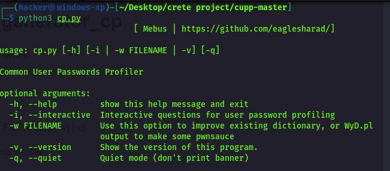

# password_generator_cp
Common password Generator 

---------------requrment--------------------------

Python 3 run

usage: cp.py [-h] [-i | -w FILENAME | -v] [-q]

Common User Passwords Profiler

optional arguments:
  -h, --help         show this help message and exit
  -i, --interactive  Interactive questions for user password profiling
  -w FILENAME        Use this option to improve existing dictionary, or WyD.pl
                     output to make some pwnsauce
  -v, --version      Show the version of this program.
  -q, --quiet        Quiet mode (don't print banner)

